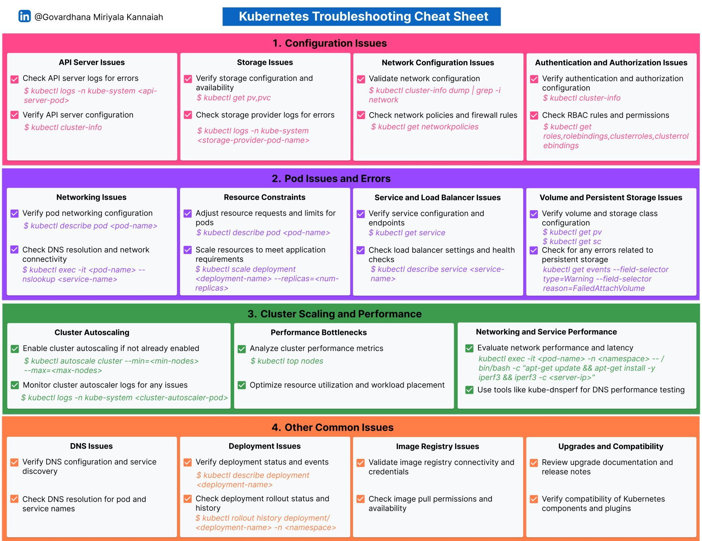

# 19. Troubleshooting

## Kubernetes troubleshooting scenarios
1. API Server Issues
2. Storage Issues
3. Network Configuration Issues
4. Authentication and Authorization Issues
5. Networking Issues
6. Resource Constraints
7. Service and Load Balancer Issues
8. Volume and Persistent Storage Issues
9. Cluster Autoscaling
10. Performance Bottlenecks
11. Networking and Service Performance
12. DNS Issues
13. Deployment Issues
14. Image Registry Issues
15. Upgrades and Compatibility

  
